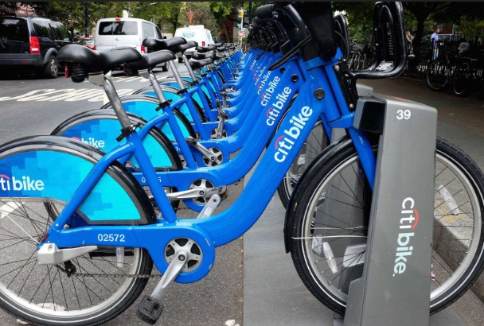

# Citi-Bike-Python-Dashboard 
*Analysis and dashboard conducted with python. Video presentation of dashboard linked below.*

### Citi Bike Analysis

Citi Bike is a bike share company that provides residents and visitors a convenient and fun way to explore a city. Facing complaints of empty stations, this analysis investigations the flow of Citi bike rides in 2022 New York to uncover possible reasons stations may be booked out during specfic time periods. The analysis explores components such as weather, start station popularity, and bike trip routes to provide recommendations. Insights are shared via a dashboard, coded in python, and a video presentation.

#### Data
Data was downloaded from:
- an open source data set from Citi Bike for the year 2022.
- gathered using NOAA's API for 2022 weather data.

 Data contains information on the following parameters:
- start station
- end station
- date
- temperature

#### Tools
For this project, the following python libraries were used:
- pandas - for data analysis
- kepler.gl - for map visualizations
- plotly - for visualizations
- streamlit - for creating a dashboard

#### Executing the code
The code is available as jupyter notebooks in this repository.

 ---

### Presentation Link: 
#### For quick access to the presenation, click [here](https://drive.google.com/file/d/13mEIIWzxd4TLsvrG5w0IN66mhHhFn0Zt/view?usp=drive_link)

